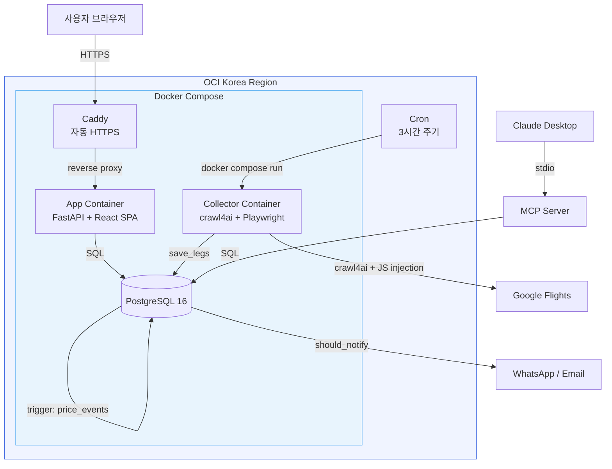

# My Flight Friend

** 항공권 최저가 자동 모니터링 시스템**

[](https://github.com/JunYupK/my-flight-friend/actions/workflows/ci.yml)
[](https://github.com/JunYupK/my-flight-friend/actions/workflows/deploy.yml)


Google Flights에서 편도 항공편을 크롤링하고, 왕복 조합을 자동 생성하여 목표가 이하의 딜을 WhatsApp/이메일로 알려주는 풀스택 모니터링 도구입니다. crawl4ai 헤드리스 브라우저와 JS injection 기반 크롤링, PostgreSQL trigger 이벤트 소싱, WebSocket 실시간 로그 스트리밍 등 다양한 기술적 도전을 해결하며 구축했습니다.

> Python 3,000줄 + TypeScript 2,200줄 | 32개 통합 테스트 | 122 커밋

<!-- 스크린샷: 웹 대시보드 이미지를 추가하면 임팩트가 큽니다

-->

---

## 아키텍처



### 데이터 흐름

```
Google Flights  ──crawl4ai──▶  raw_legs (append-only)
                                    │
                              flight_legs (UPSERT)
                                    │
                         ┌──────────┼──────────┐
                         ▼          ▼          ▼
                  price_events   왕복 조합    알림 판단
                  (DB trigger)   (cross-     (cooldown +
                                 product)    가격 하락)
                                    │          │
                                 Web UI     WhatsApp
                                            / Email
```

---

## 주요 기능

- **Google Flights 크롤링** — crawl4ai 헤드리스 브라우저 + JavaScript injection으로 DOM 파싱, 무한 스크롤 처리
- **Protobuf 기반 예약 URL 생성** — Google Flights `tfs=` 파라미터의 protobuf 인코딩을 역공학하여 직접 예약 페이지 링크 생성
- **편도→왕복 자동 조합** — 편도 운임 수집 후 서버사이드 cross-product로 최적 왕복가 산출 (혼합 항공사 지원)
- **WebSocket 실시간 로그** — 수집 실행 시 진행 상황을 브라우저에서 실시간 스트리밍
- **이벤트 소싱** — PostgreSQL `AFTER UPDATE` trigger가 가격 변동을 `price_events` 테이블에 자동 기록
- **스마트 알림** — 쿨다운 기반 중복 방지 + 가격 하락 시 재알림 트리거 (WhatsApp / Email)
- **캘린더 히트맵 + 가격 추이 차트** — 출발일별 최저가 시각화, 수집 시점별 가격 추이 그래프
- **MCP 서버** — Claude Desktop 연동, 자연어로 항공권 조회 가능 (3개 query tool 제공)

---

## 화면 구성

| 경로 | 페이지 | 설명 |
|------|--------|------|
| `/` | Landing | 프로젝트 소개 + 주요 기능 카드 |
| `/deals` | Deals | 목적지별 최저가 딜 목록, 월/소스/트립타입 필터링 |
| `/search` | Search | 캘린더 기반 날짜 선택 + 가격 히트맵 오버레이 |
| `/trends` | Trends | Recharts 기반 가격 추이 차트 (캘린더/타임라인 모드) |
| `/monitor` | Monitor | 수집 실행 이력, 상태/소요시간/에러 로그 확인 |
| `/settings` | Settings | 공항 CRUD + 검색 설정 + WebSocket 실시간 수집 실행 |

---

## 기술 스택

| 레이어 | 기술 |
|--------|------|
| **Frontend** | React 18, TypeScript, Tailwind CSS, Recharts, Vite, React Router v7 |
| **Backend** | FastAPI, Python 3.11, psycopg2, Pydantic |
| **크롤링** | crawl4ai, Playwright, JavaScript injection |
| **Database** | PostgreSQL 16 (trigger, view, event sourcing) |
| **Infra** | Docker Compose (multi-stage build), Caddy (자동 HTTPS), OCI Korea Region |
| **CI/CD** | GitHub Actions (pytest + React build → SSH 자동 배포 + 헬스체크) |
| **알림** | WhatsApp (CallMeBot), Gmail SMTP |
| **AI 연동** | MCP Server (Claude Desktop) |

---

## 기술적 도전과 해결

### 1. Google Flights에 공식 API가 없다

**문제:** Google Flights는 공개 API를 제공하지 않아 항공편 데이터를 프로그래밍 방식으로 수집할 수 없었습니다.

**해결:** crawl4ai 헤드리스 브라우저에 커스텀 JavaScript를 injection하여 DOM을 직접 파싱했습니다. `li.pIav2d` 셀렉터로 항공편 카드를 추출하고, 무한 스크롤을 자동 처리하며, 항공사/시간/경유 정보를 구조화된 데이터로 변환합니다.

**이유:** HTML 파싱보다 JS injection이 동적 콘텐츠와 무한 스크롤 환경에서 더 안정적이고, 페이지 구조 변경에도 유연하게 대응할 수 있습니다.

### 2. 예약 페이지 직접 링크가 필요하다

**문제:** 사용자가 딜을 클릭하면 해당 항공편의 Google Flights 예약 페이지로 바로 이동해야 하지만, URL의 `tfs=` 파라미터가 protobuf 기반 base64 인코딩으로 되어 있었습니다.

**해결:** `tfs=` 파라미터의 바이너리 구조를 분석하여 날짜/공항 코드가 인코딩되는 바이트 오프셋을 파악하고, 템플릿 바이트 배열에서 해당 위치를 치환하는 protobuf 인코더를 구현했습니다.

**이유:** 범용 검색 링크 대신 특정 항공편 예약 페이지로 직접 연결함으로써 사용자가 2~3번의 클릭을 절약할 수 있습니다.

### 3. 가격 변동을 놓치지 않아야 한다

**문제:** 항공편 가격이 수집 주기 사이에 변동되면 이전 가격을 잃어버리고, 가격 변동 추이를 분석할 수 없었습니다.

**해결:** `flight_legs` 테이블에 PostgreSQL `AFTER UPDATE` trigger를 설정하여, 가격이 변경될 때마다 자동으로 `price_events` 테이블에 이전/이후 가격과 변동폭을 기록합니다.

**이유:** 이벤트 소싱 패턴으로 애플리케이션 코드 수정 없이 완전한 가격 변동 이력을 확보할 수 있고, trigger 기반이므로 데이터 누락 위험이 없습니다.

### 4. 편도 운임을 왕복 딜로 만들어야 한다

**문제:** LCC 항공사는 편도 운임만 판매하므로, 왕복 검색으로는 최저가 조합을 찾을 수 없었습니다.

**해결:** 수집된 편도 레그를 서버사이드에서 cross-product 조합하여 왕복 딜을 실시간 생성합니다. 다른 항공사 간 혼합 조합도 지원하여, 가는편 Peach + 오는편 Jetstar 같은 조합도 자동으로 발견합니다.

**이유:** 기존 항공권 검색 사이트에서는 혼합 항공사 왕복 조합을 제공하지 않으므로, 직접 조합해야만 숨겨진 최저가를 찾을 수 있습니다.

---

## 프로젝트 구조

```
my-flight-friend/
├── main.py                          # 수집 파이프라인 진입점
├── mcp_server.py                    # Claude Desktop MCP 서버
├── flight_monitor/                  # 핵심 비즈니스 로직
│   ├── collector_google_flights.py  # crawl4ai + JS injection 크롤러
│   ├── collector_naver.py           # 네이버 항공 크롤러
│   ├── storage.py                   # PostgreSQL 스키마 + 데이터 액세스
│   ├── config.py                    # 검색 설정 기본값
│   ├── config_db.py                 # DB 기반 설정 로드
│   └── notifier.py                  # Telegram(1순위) → Discord(2순위) 알림
├── flight_front/
│   ├── api/main.py                  # FastAPI 백엔드
│   └── web/src/                     # React SPA
├── tests/
│   ├── test_flight_monitor.py       # storage 통합 테스트 (PostgreSQL)
│   └── test_notifier.py             # 알림 fallback 테스트
├── .github/workflows/
│   ├── ci.yml                       # pytest + React build 검증
│   └── deploy.yml                   # SSH 자동 배포 + 헬스체크
├── docker-compose.yml               # 단일 compose (profiles: full / collect)
├── Dockerfile                       # 앱 이미지 (multi-stage build)
├── Dockerfile.collector             # 수집기 이미지 (crawl4ai + Playwright)
├── Dockerfile.mcp                   # MCP 서버 이미지
└── Caddyfile                        # 리버스 프록시 + 자동 HTTPS
```

---

## 시작하기

### 사전 요구사항

- Docker (프로덕션 배포 시 이것만 있으면 됨)
- Python 3.11+ (로컬 개발 시)
- Node.js 20+ (프론트엔드 개발 시)

### 프로덕션 배포

```bash
git clone https://github.com/JunYupK/my-flight-friend.git
cd my-flight-friend
cp .env.example .env  # 환경변수 편집

docker compose --profile full up -d --build
```

### 로컬 개발

```bash
# 환경변수 설정
cp .env.example .env

# Python 의존성
pip install -r requirements.txt
crawl4ai-setup  # 헤드리스 브라우저 설치

# PostgreSQL 시작
docker compose up -d

# 항공권 수집
python main.py

# FastAPI 백엔드
uvicorn flight_front.api.main:app --reload

# React 프론트엔드 (별도 터미널)
cd flight_front/web && npm install && npm run dev
```

---

## 환경변수

| 변수 | 필수 | 설명 |
|------|------|------|
| `DATABASE_URL` | **필수** | PostgreSQL 연결 문자열 |
| `REDIS_URL` | 선택 | 캐시. 미설정 시 in-memory fallback |
| `TELEGRAM_BOT_TOKEN` / `TELEGRAM_CHAT_ID` | 선택 | 1순위 알림 채널 |
| `DISCORD_WEBHOOK_URL` | 선택 | 2순위 fallback 알림 채널 |
| `DB_PASSWORD` / `DOMAIN` | 선택 | docker-compose 풀스택 모드 |

알림 채널은 Telegram → Discord 순으로 시도하며, 첫 성공 채널만 실제 발송합니다.

---

## 테스트

PostgreSQL 기반 32개 통합 테스트. 각 테스트 전후로 `TRUNCATE ... RESTART IDENTITY CASCADE`를 실행하여 테스트 간 완전한 DB 격리를 보장합니다.

```bash
# PostgreSQL 실행 필요
docker compose up -d

pytest tests/ -v

# 특정 테스트
pytest tests/test_flight_monitor.py::TestShouldNotify
```

---

## CI/CD 파이프라인

| 단계 | 워크플로우 | 트리거 | 내용 |
|------|-----------|--------|------|
| **검증** | `ci.yml` | push, PR → master | pytest (PG 서비스 컨테이너) + `npm run build` |
| **배포** | `deploy.yml` | CI 성공 시 자동 | SSH → `git pull` → `docker compose build` → 헬스체크 |
| **수집** | OCI cron | 3시간 주기 | `docker compose run collector` |
| **백업** | OCI cron | 매일 03:00 KST | `pg_dump` + gzip (7일 보존) |
